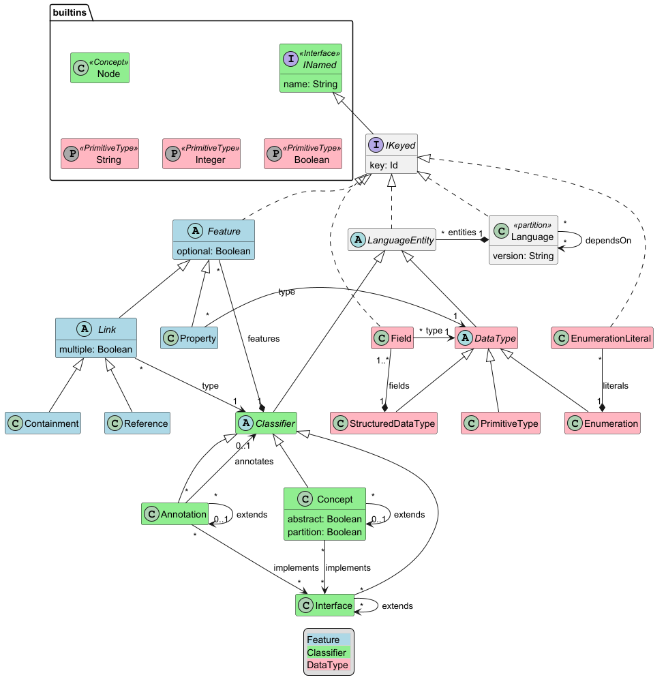

# README

This project contains the C# implementation of (parts of) the [LionWeb specification](https://lionweb.io/specification/).
Specifically supported are:

* language definition through the [LionCore M3 meta-metamodel](hhttps://lionweb.io/specification/metametamodel/metametamodel.html),
* serialization and deserialization of both languages and instances of those conforming to the [LionWeb JSON serialization format](https://lionweb.io/specification/serialization/serialization.html),
* a generic, dynamic/reflective base implementation of nodes,
* C# type generation.

For convenience, the UML representation of the LionCore M3 meta-metamodel, including the separate LionCore built-ins language, is reproduced here:



The LionCore built-ins language contains several classifiers (=instances of `Classifier`, so reside on the M2-level because they don't admit a self-definition) that can be used within any language definition.
These specifically are

* the `INamed` interface – because many concepts have a "name" property,
* the generic `Node` concept – to use as the type of the target(s) of an untyped reference relation,
* the four built-in primitive types.


## Project organization

Various aspects of LionWeb are represented as directories at the top-level of this project.

* `Core/`:
    * [base types](Core/BaseTypes.cs), including `Node`, a generic, dynamic/reflective implementation of `INode`, [release version declaration](Core/LionWebVersions.cs)
    * `M2/`: [LionCore built-ins](Core/M2/IBuiltInsLanguage.cs)
    * `M3/`: [implementation of the LionCore M3](Core/M3/Types.cs) to define languages with, computed properties and extension methods defined on top of those, and (de-)serialization of language definitions
	* `Serialization/`: implementation of (de-)serialization for the `Node` type, and definition of the serialization chunk format (after it's been unmarshalled from JSON)
    * `Utilities/`: utilities like `Cloner`, `Comparer`, or `ReferenceUtils`
    * `Notificaiton/`: [LionWeb notification system](Core/Notification/README.md)  
* `docs/`: documentation, mainly in the form of diagrams of that as well


## API

### Languages

Serializing instances of `Language` as a [LionWeb serialization](https://lionweb.io/specification/serialization/serialization.html) chunk can be done as follows:

```csharp
// serialization to internal format:
using LionWeb.Core.M1;
SerializationChunk serializationChunk = new Serializer(LionWebVersions.Current).SerializeToChunk(languages);

// serialization of internal format to JSON:
using LionWeb.Core.Serialization;
JsonUtils.WriteJsonToFile(<path>, serializationChunk);
```

(Also note that code in these snippets – in particular the `using` statements – might not be syntactically correct.
 Adjust before use.)

Deserializing a LionWeb serialization chunk containing one or more languages can be done as follows:

```csharp
JsonUtils.ReadNodesFromStreamAsync(utf8JsonStream, new LanguageDeserializer(LionWebVersions.Current))
    .GetAwaiter()
    .GetResult()
    .Cast<Language>();
```


### Instances

Serializing nodes (as instances of `Node`) can be done as follows:

```csharp
JsonUtils.WriteNodesToStream(utf8JsonStream, new Serializer(LionWebVersions.Current), <nodes>)
```

Deserializing a LionWeb serialization chunk that's the serialization of nodes from one language can be done as follows:

```csharp
/// Configure and create deserializer:
var deserializer = new DeserializerBuilder()
    .WithLanguage(<language instance>)
    .Build();

// read the JSON:
var List<IReadableNode> nodes = JsonUtils.ReadNodesFromStreamAsync(utf8JsonStream, deserializer)
    .GetAwaiter()
    .GetResult();
```
